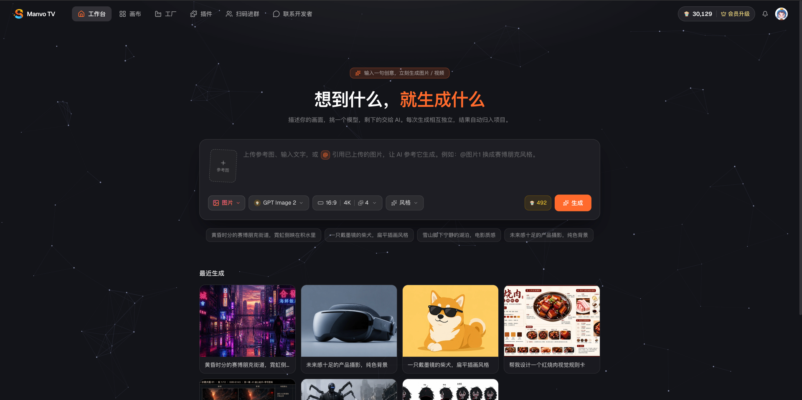
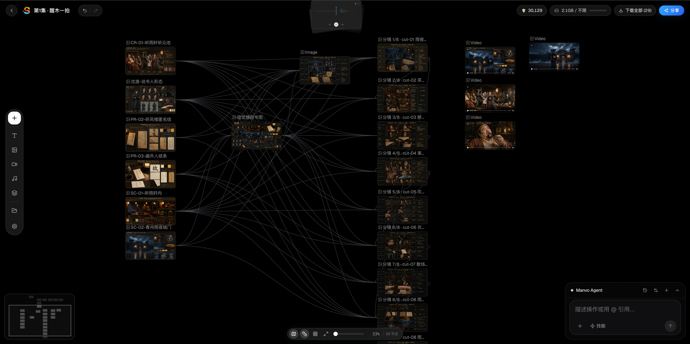
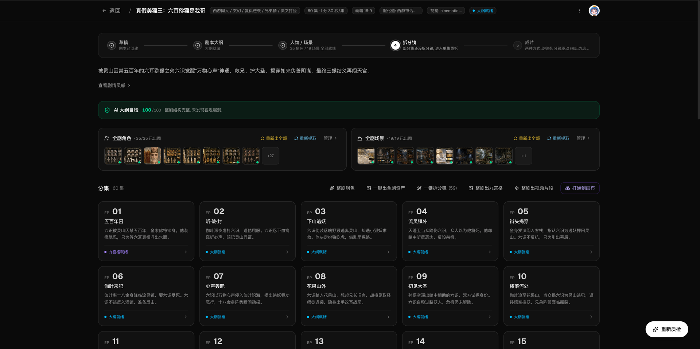
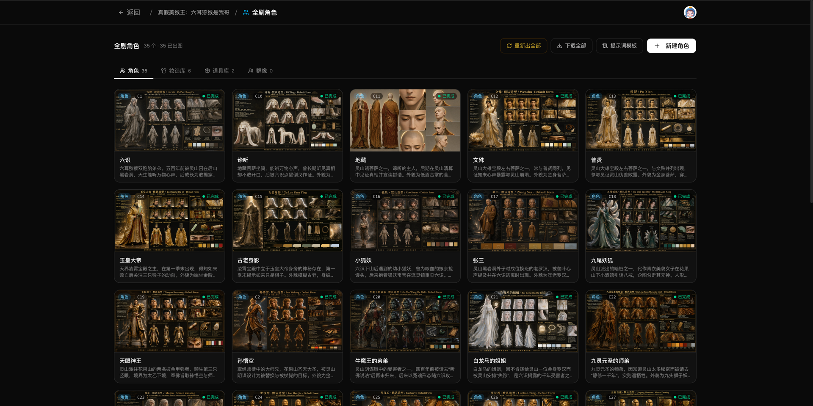
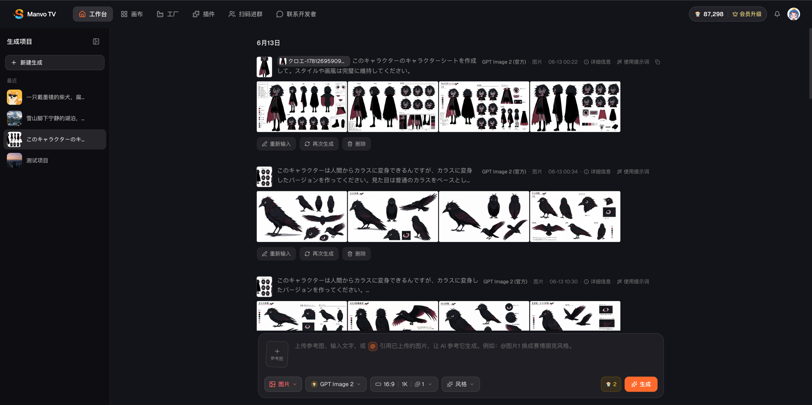
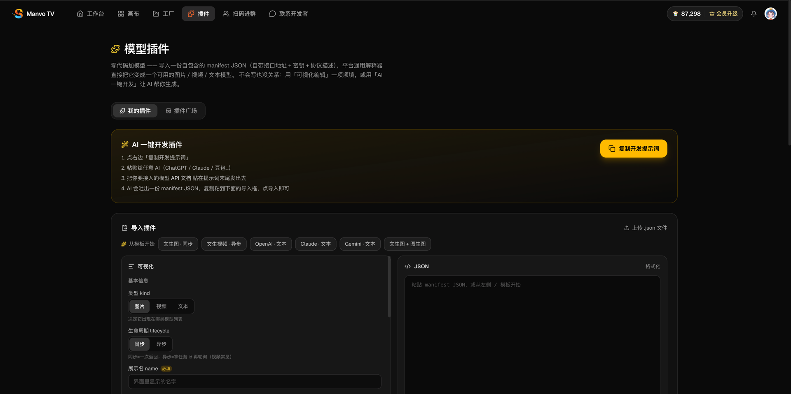

# 🎬 Manvo TV

### 想到什么，就生成什么

**面向创作者的 AI 原生创作平台 —— 把「从一句想法到一条成片」的整条路，收进同一个工作空间。**

&nbsp;

&nbsp;

&nbsp;

 

---

## 一句话介绍

**Manvo TV** 是一个面向 AI 短剧 / 漫剧 / 广告片创作者的一站式平台。它由两块咬合在一起的能力组成：

- 🪐 **无限画布** —— 像在白板上摊开素材一样，自由摆放文本、图片、视频、音频和 AI 生成节点，节点之间还能连线、成组、引用，把零散的创作步骤变成一张能看见关系的网。
- 🏭 **漫剧剧本工厂** —— 一条工业化的流水线：丢进一个剧本，自动产出大纲、分集、角色与场景设定，再拆成九宫格故事板，最后批量出图、出视频。

一个适合**天马行空地探索**，一个适合**规模化地量产**。前者解决「灵感怎么落地」，后者解决「落地之后怎么批量做完一整部」。

而且**怎么用都随你**：不想折腾就用**平台内置算力**，免配任何 API、**免费注册即用**，**每日签到还能领免费算力**；想完全掌控成本就**自带 API**，用自己的额度与渠道；想换别的模型，**零代码就能接进来**。画布还支持**多人实时协同**，一张画布、一群人一起把片子做出来。

---

## 为什么做这个

做过 AI 短剧、漫剧、广告片的人都有同一种痛：**工具是散的。**

写脚本在一个软件，拆分镜在另一个，生图在第三个，出视频又得换地方。每换一次工具，上下文就断一次 —— 上一镜用的角色长什么样、这场戏在哪个场景、风格是什么，全靠人脑和来回复制粘贴去对齐。结果就是「单张图都挺好看，连起来全是两个人」。

更要命的是**一致性**和**规模**这两件事天然打架：想要角色、场景在几十上百个镜头里都长一个样，靠手工根本盯不过来；可一旦上了量，一致性就崩。

> Manvo TV 的解法很直接：让素材带着「关系」存在；让「资产」成为一切的地基，所有镜头都引用同一套角色卡 / 场景卡，一致性从源头锁死；把 AI 生成变成创作流程里的原生动作，而不是一个个要跳出去的外部工具。

---

## 🎨 核心能力

### 🪐 无限画布 · 把创作摊在一张桌子上

- **多模态节点**：文本、图片、视频、音频、分镜板、角色卡 / 场景卡、参考素材、AI 生成节点，统统放进同一张画布，自由拖拽、缩放、框选、成组。
- **节点连线与工作流**：从一个节点拉出连线指向另一个，关系一目了然；多个节点成组，作为一个镜头序列统一管理。
- **AI 生成内嵌**：选中一张图就能直接 **改角度、重新打光、图生视频、局部重绘、画面扩展、角色一致性扩写**，不用导出再导入。
- **九宫格速拆**：一张九宫格故事板，一键切成九个独立镜头，逐镜进入生成。
- **多角度 / 多光线探索**：对同一角色或场景，快速生成不同机位、不同光线的版本，横向比对挑最好的。
- **实时协作**：多人同时在一张画布上编辑，光标与选区实时可见，改动即时同步、互不打架。

### 🏭 漫剧剧本工厂 · 一条能量产的流水线

核心理念是 **「资产为根基」** —— 先把角色、场景这些「演员和布景」定下来，后面所有画面都引用它们，一致性才稳得住。整条流水线是这样走的：

| 阶段 | 它替你做的事 |
|---|---|
| **① 智能立项** | 丢进一个剧本，AI 解析出题材、基调、核心矛盾，自动建项 |
| **② 大纲与分集** | 生成全剧大纲，并派生出每一集的剧情，附带质检报告与一键优化 |
| **③ 角色 / 场景资产卡** | 为每个角色、每个场景生成多面板「设定资料卡」，作为后续所有画面的视觉基准 |
| **④ 九宫格故事板** | 把每一集拆成若干个 ≤15 秒的镜头，每个镜头展开成一张 3×3 九宫格分镜 |
| **⑤ 出图 → 出视频** | 以九宫格为故事线，叠加角色大图、场景大图作为多参考，批量生成画面与视频 |

围绕这条主线，还有一整套**让它真的能量产**的能力：批量与单张并行、统一任务队列与进度、**内容锁定**（满意的某集锁住，重生成自动绕开）、**重生成即退还存储**、长流程**异步容灾、可中断可续跑**。

### 🎭 角色 & 场景资产 · 一致性从源头锁死

每个角色、场景先成一张多面板设定卡，全剧所有镜头都引用同一套参考；提示词里还会**点名**每个角色，让模型把参考图对到正确的人，从机制上压住「换脸 / 串戏 / 风格漂移」。支持**造型系统**（同一角色多套服饰造型）与**群像卡**（主角团各成员分别一致后再组合）。出镜头时若发现引用的资产还没生成，会用同一套出图逻辑**自动补齐**再合成，绝不另起一套风格。

### 💬 对话式创作 · 边聊边出

在工作台里用对话的方式描述需求，即可连续生成角色设定、分镜、素材；选模型、选比例、挂参考，一句话推进下一步。

### 🔌 多模型接入 · 免配直用，或自带 API

平台不绑死单一模型，文本、图像、视频、音频各取所长，按场景**自由选择用哪个模型**生成。算力怎么用，主动权在你手里：

- **🍿 免配 API · 用内置算力（可免费用）**：不想折腾任何 Key？**免费注册即可**用平台内置算力，开箱即生成；**每日签到还能领免费算力**，零成本也能持续创作，用得多了再充值或开会员。
- **🔑 自带 API · 完全掌控**：填入你自己的模型 API，用自己的额度与渠道，**成本与配额尽在掌握**。
- **🧩 零代码插件市场**：粘贴一份自包含的 JSON 即可把**任意自有模型**接进平台；还能复制开发提示词让 AI **一键生成插件配置**、图形化可视化编辑，自建插件**一键分享**到插件广场。

---

## 🌟 亮点与创新

- **九宫格故事板这种「叙事单元」**：不是一张图配一句提示词，而是把一个短镜头拆成 9 格连续画面、当成一段微型故事来生成，再以它为故事线去出视频 —— 画面的**连贯性和可控性**强一个量级。
- **「资产为根基」的一致性闭环**：角色 / 场景先成卡，所有镜头挂同一套参考图，提示词点名锚定，缺失资产自动补齐 —— 从机制上压住换脸与风格漂移。
- **出视频时现编「专业视频提示词」**：发起出视频的那一刻，实时把九宫格故事线 + 挂载的角色 / 场景，现编成一条结构化视频指令（运镜、时间线、一致性约束、合规规避都在里面），而不是复用一句简单描述。
- **整套工作流带异步容灾、随时可恢复**：拆本、出图、出视频这些长流程都可中断、可续跑 —— 服务重启、网络抖动、单个任务失败都不会让整批前功尽弃。这是「能不能真的量产一整部」的分水岭。
- **算力随你选 —— 免配直用，或自带 API**：新手用平台**内置算力**，零配置、开箱即生成；老手填入**自己的 API**，额度与成本完全自己掌控；还能**零代码把任意模型接进来**。模型不绑死，怎么省心怎么来。
- **多人实时协同创作**：一张画布多人同时编辑，谁在改哪里一目了然 —— 光标与选区实时可见、改动即时同步、互不打架，像在一块共享白板上一起把片子做出来。
- **画布与工厂打通**：天马行空的探索（画布）和规模化的量产（工厂）不是两个割裂的产品，而是同一套素材、同一套资产在两种工作方式间流转，一键互通。

---

## 👥 适合谁

AI 短剧 / 漫剧创作者 · 广告片 / TVC 创作者 · 分镜设计师 / 视觉策划 · 自媒体视频创作者 · AI 工作流爱好者。

**典型场景**：从一句创意生成脚本大纲 → 拆成分镜 → 九宫格逐镜生成 → 批量出图出视频；对同一角色做多角度、多光线探索；把一整部漫剧的角色、场景、分镜、成片全部留在同一个空间里量产。

---

## 🚀 立即体验

| | |
|---|---|
| 🌐 **访问地址** | **<https://manvo.tv>** |
| 🧭 **推荐浏览器** | Chrome 最新版（现代 Chromium 内核均可） |
| 💻 **运行方式** | 纯网页应用，**免安装、免插件**，打开即用 |
| 🖥️ **显示建议** | 桌面端、1080p 及以上分辨率体验最佳 |

> 想最快看到核心价值：进「**漫剧剧本工厂**」走一遍完整流程（建项 → 大纲分集 → 出角色/场景资产 → 拆九宫格 → 出图/出视频）；想自由探索就进「**画布**」。

---

## 📬 联系我们

- 🌐 官网：<https://manvo.tv>
- 💬 用户社群 / 联系开发者：见站内「扫码进群」与「联系开发者」入口

---

### 我们想做的

不是又一个「能生成图片的工具」，而是一个能把 **创意、一致性、规模化** 这三件事同时握住的创作平台 ——
**让一个人，也能像一个小团队一样，安安稳稳地做完一整部作品。**

 

© 2026 Manvo TV. **版权所有 · All Rights Reserved.**

*本仓库仅用于产品展示与推广，包含的文字与截图均为 Manvo TV 知识产权，未经授权不得转载、复制或用于商业用途。本产品为闭源软件，本仓库不包含任何源代码。*

